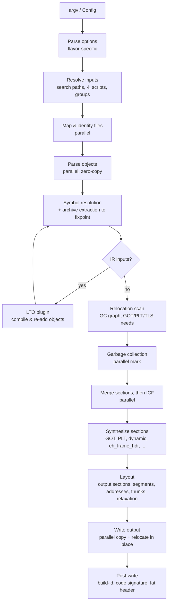

# Architecture

This document describes the planned internal design of qld. It will be updated
as implementation decisions are made. When the code and this document
disagree, fix one of them.

## Design principles

1. **Never copy input data.** Inputs are memory-mapped. Section contents,
   symbol names and relocations are read directly from the mapping through
   typed, zero-copy views, and bytes are copied only into the output file.
2. **Parallel by default, deterministic always.** Every stage whose work
   divides by file, section or symbol runs on a work-stealing thread pool
   (rayon). Any result that depends on ordering is decided by input order
   (command-line position, then position in the file), never by which thread
   finished first.
3. **Indices, not pointers.** Files, sections and symbols are identified by
   dense `u32` newtypes (`FileId`, `SectionId`, `SymbolId`). Per-entity data
   lives in vectors indexed by those IDs, in struct-of-arrays form where a hot
   loop touches only one field. This keeps data cache-friendly, lets it be
   shared across threads without reference counting, and avoids lifetime
   tangles.
4. **Do work lazily and only once.** An archive member is parsed only when it
   is extracted. Relocations are scanned once to build the GC graph and the
   GOT/PLT requirements. DWARF line tables are parsed only to render a
   diagnostic.
5. **Monomorphize the hot paths.** ELF class and endianness (`Elf64Le`,
   `Elf32Be`, …) and the target architecture are type parameters. The inner
   loops that apply relocations never branch on format at run time. (The
   COFF and Mach-O readers use runtime flags instead: their inputs are
   effectively always 64-bit little-endian, and a non-generic file type is
   simpler for the linker to store.)
6. **Share infrastructure, not semantics.** ELF, PE/COFF and Mach-O disagree
   on symbol precedence, COMDAT/weak semantics, namespaces and layout. lld
   showed that forcing one format-neutral symbol model on all of them costs
   more than it saves. qld shares the machinery (arenas, interning, a
   concurrent symbol table, the GC and ICF engines, merging, output writing,
   archives, diagnostics) in modules that know nothing about any format. Each
   format backend owns its own resolution rules and layout.
7. **Malformed input is an error, not a panic.** Input files are untrusted.
   Every offset and size is bounds-checked, and a parse failure becomes a
   diagnostic that names the file and offset.

## Link pipeline



### 1. Option parsing

A flavor-specific front end turns argv into a `LinkOptions` value. The flavors
are GNU (ld/gold/lld/mold), ld64 and later possibly lld-link. `LinkOptions` is
plain data with no file-system access, so library users can build it directly.
Positional flags (`--whole-archive`, `--as-needed`, `-Bstatic`, groups) become
attributes on each input entry, not global state. See
[compatibility.md](compatibility.md).

### 2. Input resolution

qld expands `-l` names and `-l:file` against `-L` paths and the sysroot, reads
response files, and follows linker scripts used as inputs (for example
glibc's `libc.so`, which is a text `GROUP(...)`). The result is an ordered
list of `InputSpec { path, attrs, position }`. This stage is sequential and
cheap; the expensive work is in the next stages.

### 3. Mapping and identification

All inputs are mapped in parallel (`memmap2`; small files may be read into a
buffer instead). Each file's format is identified by its magic: ELF, COFF,
Mach-O, fat, `!<arch>`, `!<thin>`, LLVM bitcode, GCC LTO IR (an ELF with
`.gnu.lto_*` sections), or text (a linker script or `.tbd`). A target mismatch,
such as an i386 object in an x86-64 link, is reported here.

### 4. Object parsing

Each object is parsed in parallel into a per-file structure. It holds the
section headers, a local symbol table that maps each entry to a global
`SymbolId` once names are interned, and relocation slices that stay unparsed
until they are needed. Symbol names are hashed during this parallel pass, so
the resolution phase never hashes a string twice.

Mergeable sections (`SHF_MERGE`) are split into pieces here too, with each
piece's hash computed on the same pass. The relocation scan (stage 6) needs
pieces to exist so it can express a reference into a merge section as
(piece, addend within piece); deduplication waits until after GC.

Archives start as a symbol index (the armap, or a scan of members when there
is none). A member is parsed only when resolution extracts it. `--whole-archive`
members are parsed eagerly.

### 5. Symbol resolution

The global symbol table is a sharded concurrent hash map, keyed by interned
name plus version where the format has versions, with the precomputed hash
selecting the shard. Each symbol records its current best definition. Each
format backend supplies a precedence function for "which definition wins"
(ELF: strong > common > weak > shared > lazy, where the larger of two common
symbols wins). COMDAT groups are claimed before their definitions are
inserted, through a per-round hook: the earliest round wins, then the lowest
input position within the round, and claims from earlier rounds are final.
Definitions in discarded group copies are never inserted. (The ELF backend
still deduplicates after resolution until it adopts the hook.)

Symbol IDs never depend on thread scheduling. Names are interned in batches:
new names are collected in parallel, then numbered in order of first
occurrence (input position, then symbol index), so a parallel run assigns the
same IDs as a single-threaded one.

Archive extraction proceeds in rounds until nothing changes:

0. Load the files that became live in this round (in parallel), then run the
   backend's round hook on them in input order (COMDAT claims).
1. Intern the new files' names and insert their definitions and references,
   in one parallel pass over the new files only. Rounds under a few thousand
   symbols run on the calling thread, where splitting work costs more than
   it saves.
2. Collect the symbols that became referenced in this round (or whose best
   definition only just became lazy) and that some archive's lazy index can
   satisfy. Symbols handled in earlier rounds are not examined again.
3. Extract the chosen members. When several archives can satisfy a symbol,
   the one earliest on the command line wins. Parse the members in parallel
   and go back to step 1.

Because of this, input order does not affect *whether* a symbol resolves (as
in lld and mold). It still decides *which* definition wins, so GNU order
behavior is kept where it matters. See
[compatibility.md](compatibility.md#archive-resolution-order).

When LTO inputs exist, their symbol tables (supplied by the plugin) take part
in resolution. Once resolution settles, the plugin compiles the IR, the
resulting native objects replace the IR inputs, and resolution runs a second
time from a fresh symbol table (exactly twice, not a loop). See
[optimizations.md](optimizations.md#lto).

### 6. Relocation scan

Relocations of all live sections are scanned once, in parallel. The scan does
three things:

- It records the edges of the section reachability graph (for GC).
- It sets per-symbol flags: needs GOT, needs PLT, needs copy relocation, needs
  TLS GOT/descriptor, address-taken. The flags are atomic bit sets, so threads
  can OR them in without locks.
- It counts the dynamic relocations each output section will need.

### 7. Garbage collection

`--gc-sections` runs a parallel graph mark. It starts from the roots: the entry
point, `-u`/`--undefined`, exported and dynamic symbols, `KEEP` sections,
init/fini arrays, `SHF_GNU_RETAIN`, and non-allocated sections. Work spreads
over rayon scopes, and each section's mark bit is claimed atomically (a cheap
read first, then an atomic OR).
Unmarked sections are removed, along with their FDEs in `.eh_frame`. Symbols
that are then no longer referenced are dropped from GOT/PLT and from the
dynamic symbol table. See [optimizations.md](optimizations.md#garbage-collection-tree-shaking).

### 8. Merging, then folding

Order matters: merging runs first, because ICF must compare references into
merge sections by the piece they land on, not by input section and offset.

1. **Mergeable sections**: the live pieces split in stage 4 are inserted into
   a sharded deduplicating map and assigned output offsets in first-occurrence
   order.
2. **ICF** hashes section contents together with their relocation targets
   (references into merge sections resolved to merged pieces) and refines
   equivalence classes over parallel rounds until nothing splits. `safe` mode
   uses the address-significance tables.

### 9. Synthetic sections

The format backend creates its linker-generated content: GOT, PLT, `.dynamic`,
`.dynsym`/`.dynstr`, hash tables, `.rela.dyn`/`.relr.dyn`, version sections,
`.eh_frame_hdr`, `.note.gnu.build-id`, the PE import/export tables and base
relocations, Mach-O stubs, fixups and `__unwind_info`. At this point each one
knows its size, or at least an upper bound.

### 10. Layout

- **Output section assignment** uses the default rules, or the linker script
  when one is given. For ELF the default layout matches GNU ld's built-in
  script semantics, for example `.text.hot.*` grouping and `.rodata` placement.
  A script (or a command-line address option such as `-Ttext`) switches layout
  to `elf::script_layout`, which follows GNU ld's own algorithms: plan
  (flatten the script, expand `OVERLAY`, apply `INSERT`) → placement (match
  input sections, place orphans) → engine (the size and assignment fixpoint
  with `MEMORY` regions and `DATA_SEGMENT_*`) → segments. Plain links keep the
  simpler `elf::layout` path, and the default script is expressed in the same
  engine.
- **Sorting**: `SORT_BY_*`, init priorities, and `--symbol-ordering-file`.
- **Address assignment**, then segment construction (`PT_LOAD` and friends,
  PE sections, Mach-O segments).
- **Thunks and relaxation** (for architectures with limited branch range, or
  size-changing relaxation such as RISC-V) repeat address assignment until
  the result stops changing. Each iteration is incremental, and the number of
  iterations is capped.

### 11. Output writing

The final file size is known before any byte is written. The writer then:

1. Creates the output as a temporary file next to the final path, sets its
   length and maps it writable. When mapping is impossible it writes to a
   heap buffer instead. Pipes and devices (including anything under `/dev`
   and `/proc`) are written into directly, never replaced.
   On commit, the old output is unlinked and the temporary file renamed into
   place. This avoids `ETXTBSY` when the old output is running, leaves the old
   output intact if the link fails, and avoids the data flush that btrfs and
   ext4 trigger when a rename replaces an existing file (measured: 45 ms
   versus 270–550 ms for a 1 GiB output). Unlink-first and plain atomic
   rename are available as alternative strategies.
2. Splits the mapping into disjoint `&mut [u8]` slices, one per output chunk.
   This uses `split_at_mut` and is the one place that needs careful slicing,
   but no `unsafe` aliasing.
3. Writes the chunks in parallel. Each chunk copies its input sections and
   applies relocations in place, reading relocation entries straight from the
   input mapping.
4. Runs the post-write steps: a build-id hash computed over fixed-size blocks
   in parallel and then combined, the Mach-O code signature, and the fat
   header.

Removing a large old output file can run on a background thread so that it
doesn't hold up the link.

## Module layout

qld is a **single crate**. It builds as one library plus one binary, and the
modules follow the pipeline above.

```
qld/
├── Cargo.toml              # rust-version = "1.89", edition = "2024"
├── src/
│   ├── lib.rs              # public API, module tree, `link()`
│   ├── main.rs             # the `qld` binary: a thin wrapper over the library
│   ├── error.rs            # fatal errors
│   ├── diag.rs             # diagnostics and sinks
│   ├── ids.rs              # FileId / SectionId / SymbolId
│   ├── target.rs           # format + architecture + ABI
│   ├── args/               # LinkOptions and the GNU / ld64 argv front ends
│   ├── input/              # mmap, format identification, ar archives
│   ├── symbols/            # interning and the concurrent symbol table
│   ├── passes/             # GC, ICF, merge sections (format-neutral)
│   ├── script/             # GNU linker script lexer, parser, evaluator
│   ├── output/             # output file writer, build-id, post-write steps
│   ├── elf/                # ELF backend (read, layout, synth, arch/)
│   ├── coff/               # PE/COFF backend
│   ├── macho/              # Mach-O backend, .tbd, fat binaries, code signing
│   ├── arch/               # instruction-level helpers shared across formats
│   ├── debug/              # DWARF: compression, indexes, line lookup
│   └── plugin/             # LTO plugin host (feature `plugin`)
├── tests/                  # integration tests and fixtures
├── fuzz/                   # cargo-fuzz targets
├── benches/                # benchmark drivers (see testing.md)
└── docs/
```

Boundaries are enforced by review rather than by the compiler: the shared
modules (`input`, `symbols`, `passes`, `output`) must not reference a format
backend. Only the root re-exports in `lib.rs` are a public, semver-stable API;
everything else is `pub` for convenience and may change.

Who works where, and which files each task owns, is in
[workstreams.md](workstreams.md).

## Memory model

- **Input mappings** live in an `Arc`-owned file table for the whole link.
  Parsed structures borrow from them with the link's lifetime `'a`.
- **Arenas**: per-thread bump allocation for intermediate data with the link's
  lifetime (merged-string pieces, thunk records). Nothing is freed individually.
- **Large flat vectors** indexed by ID hold per-section and per-symbol state.
  Where threads write concurrently, that state uses atomic fields.
- **Interned strings** are `&'a [u8]` slices into the input mapping, not
  owned `String`s. Symbol names are raw bytes and are never assumed to be UTF-8.
- **Teardown**: the CLI exits without dropping the link state, as mold and
  lld do. The library API frees everything in the normal way.

## Concurrency toolkit

| Need | Approach |
| --- | --- |
| Data-parallel loops over files/sections | `rayon` parallel iterators |
| Graph traversal (GC, archive rounds) | `rayon::scope` with work-stealing; atomic visited bits |
| Global symbol table | sharded `hashbrown` tables behind per-shard locks, shard chosen by precomputed hash |
| Per-symbol flags | `AtomicU32` bitsets |
| Deduplication (merge sections, ICF) | sharded concurrent maps; ties broken by input order |
| Output writing | disjoint mutable slices from one writable mapping |

Library users can run qld inside their own rayon pool
(`ThreadPool::install`). Parallel stages run on whatever pool is current, so a
call made outside `install` uses (and lazily creates) rayon's global pool. The
`link()` entry point will install a pool sized by `--threads` for its
duration, so the CLI and library callers who don't bring a pool get the
configured thread count.

## Error handling and diagnostics

- The library returns `Result<_, qld::Error>`. Errors and warnings go to a
  `DiagnosticSink` trait object. The CLI renders them in GNU style
  (`qld: error: …`), and library users can collect them as structured values.
- Errors from parallel stages are collected rather than stopping at the first
  one. They are sorted by input position before reporting, so the output is
  deterministic.
- Location info is `file(member):(section+offset)`, and source file:line is
  added when DWARF is available (`debug::dwarf::LineLookup`). It is computed
  lazily, only when a diagnostic is actually emitted.
- Undefined-symbol errors get hints from `hints::Hinter` (missing `-l`,
  version mismatches, near-miss names), built only after the link has
  already failed. Names are shown demangled through `demangle`.
