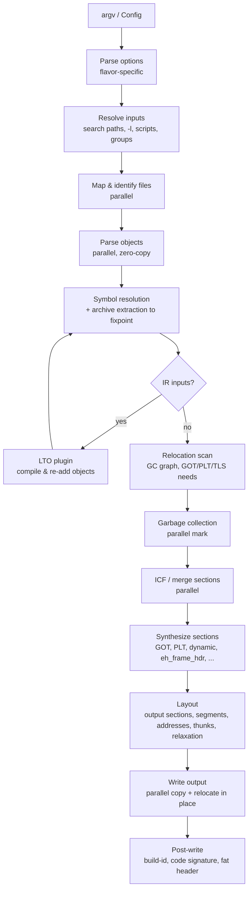

# Architecture

This document describes the planned internal design of qld. It will be updated
as implementation decisions are made. When the code and this document
disagree, fix one of them.

## Design principles

1. **Never copy input data.** Inputs are memory-mapped. Section contents,
   symbol names and relocations are read directly from the mapping through
   typed, zero-copy views, and bytes are copied only into the output file.
2. **Parallel by default, deterministic always.** Every stage whose work
   divides by file, section or symbol runs on a work-stealing thread pool
   (rayon). Any result that depends on ordering is decided by input order
   (command-line position, then position in the file), never by which thread
   finished first.
3. **Indices, not pointers.** Files, sections and symbols are identified by
   dense `u32` newtypes (`FileId`, `SectionId`, `SymbolId`). Per-entity data
   lives in vectors indexed by those IDs, in struct-of-arrays form where a hot
   loop touches only one field. This keeps data cache-friendly, lets it be
   shared across threads without reference counting, and avoids lifetime
   tangles.
4. **Do work lazily and only once.** An archive member is parsed only when it
   is extracted. Relocations are scanned once to build the GC graph and the
   GOT/PLT requirements. DWARF line tables are parsed only to render a
   diagnostic.
5. **Monomorphize the hot paths.** ELF class and endianness (`Elf64Le`,
   `Elf32Be`, …) and the target architecture are type parameters. The inner
   loops that apply relocations never branch on format at run time.
6. **Share infrastructure, not semantics.** ELF, PE/COFF and Mach-O disagree
   on symbol precedence, COMDAT/weak semantics, namespaces and layout. lld
   showed that forcing one format-neutral symbol model on all of them costs
   more than it saves. qld shares the machinery (arenas, interning, a
   concurrent symbol table, the GC and ICF engines, merging, output writing,
   archives, diagnostics). Each format backend owns its own resolution rules
   and layout.
7. **Malformed input is an error, not a panic.** Input files are untrusted.
   Every offset and size is bounds-checked, and a parse failure becomes a
   diagnostic that names the file and offset.

## Link pipeline



### 1. Option parsing

A flavor-specific front end turns argv into a `LinkOptions` value. The flavors
are GNU (ld/gold/lld/mold), ld64 and later possibly lld-link. `LinkOptions` is
plain data with no file-system access, so library users can build it directly.
Positional flags (`--whole-archive`, `--as-needed`, `-Bstatic`, groups) become
attributes on each input entry, not global state. See
[compatibility.md](compatibility.md).

### 2. Input resolution

qld expands `-l` names and `-l:file` against `-L` paths and the sysroot, reads
response files, and follows linker scripts used as inputs (for example
glibc's `libc.so`, which is a text `GROUP(...)`). The result is an ordered
list of `InputSpec { path, attrs, position }`. This stage is sequential and
cheap; the expensive work is in the next stages.

### 3. Mapping and identification

All inputs are mapped in parallel (`memmap2`; small files may be read into a
buffer instead). Each file's format is identified by its magic: ELF, COFF,
Mach-O, fat, `!<arch>`, `!<thin>`, LLVM bitcode, GCC LTO IR (an ELF with
`.gnu.lto_*` sections), or text (a linker script or `.tbd`). A target mismatch,
such as an i386 object in an x86-64 link, is reported here.

### 4. Object parsing

Each object is parsed in parallel into a per-file structure. It holds the
section headers, a local symbol table that maps each entry to a global
`SymbolId` once names are interned, and relocation slices that stay unparsed
until they are needed. Symbol names are hashed during this parallel pass, so
the resolution phase never hashes a string twice.

Archives start as a symbol index (the armap, or a scan of members when there
is none). A member is parsed only when resolution extracts it. `--whole-archive`
members are parsed eagerly.

### 5. Symbol resolution

The global symbol table is a sharded concurrent hash map, keyed by interned
name plus version where the format has versions, with the precomputed hash
selecting the shard. Each symbol records its current best definition. Each
format backend supplies a precedence function for "which definition wins"
(ELF: strong > weak > common > lazy > shared, with COMDAT groups deduplicated
by first occurrence in input order).

Archive extraction proceeds in rounds until nothing changes:

1. Insert the definitions of all live objects, in parallel.
2. Collect the undefined symbols that some archive's lazy index can satisfy.
3. Extract the chosen members. When several archives can satisfy a symbol,
   the one earliest on the command line wins. Parse the members in parallel
   and go back to step 1.

Because of this, input order does not affect *whether* a symbol resolves (as
in lld and mold). It still decides *which* definition wins, so GNU order
behavior is kept where it matters. See
[compatibility.md](compatibility.md#archive-resolution-order).

When LTO inputs exist, their symbol tables (supplied by the plugin) take part
in resolution. Once resolution settles, the plugin compiles the IR, the
resulting native objects replace the IR inputs, and resolution runs again. See
[optimizations.md](optimizations.md#lto).

### 6. Relocation scan

Relocations of all live sections are scanned once, in parallel. The scan does
three things:

- It records the edges of the section reachability graph (for GC).
- It sets per-symbol flags: needs GOT, needs PLT, needs copy relocation, needs
  TLS GOT/descriptor, address-taken. The flags are atomic bit sets, so threads
  can OR them in without locks.
- It counts the dynamic relocations each output section will need.

### 7. Garbage collection

`--gc-sections` runs a parallel graph mark. It starts from the roots: the entry
point, `-u`/`--undefined`, exported and dynamic symbols, `KEEP` sections,
init/fini arrays, `SHF_GNU_RETAIN`, and non-allocated sections. Work spreads
over rayon scopes, and each section's mark bit is an atomic compare-and-swap.
Unmarked sections are removed, along with their FDEs in `.eh_frame`. Symbols
that are then no longer referenced are dropped from GOT/PLT and from the
dynamic symbol table. See [optimizations.md](optimizations.md#garbage-collection-tree-shaking).

### 8. Folding and merging

- **ICF** hashes section contents together with their relocation targets and
  refines equivalence classes over a few parallel rounds. `safe` mode uses the
  address-significance tables.
- **Mergeable sections** (`SHF_MERGE`, including `SHF_STRINGS`) are split into
  pieces in parallel, inserted into a concurrent deduplicating map, and then
  assigned output offsets in a deterministic order.

### 9. Synthetic sections

The format backend creates its linker-generated content: GOT, PLT, `.dynamic`,
`.dynsym`/`.dynstr`, hash tables, `.rela.dyn`/`.relr.dyn`, version sections,
`.eh_frame_hdr`, `.note.gnu.build-id`, the PE import/export tables and base
relocations, Mach-O stubs, fixups and `__unwind_info`. At this point each one
knows its size, or at least an upper bound.

### 10. Layout

- **Output section assignment** uses the default rules, or the linker script
  when one is given. For ELF the default layout matches GNU ld's built-in
  script semantics, for example `.text.hot.*` grouping and `.rodata` placement.
- **Sorting**: `SORT_BY_*`, init priorities, and `--symbol-ordering-file`.
- **Address assignment**, then segment construction (`PT_LOAD` and friends,
  PE sections, Mach-O segments).
- **Thunks and relaxation** (for architectures with limited branch range, or
  size-changing relaxation such as RISC-V) repeat address assignment until
  the result stops changing. Each iteration is incremental, and the number of
  iterations is capped.

### 11. Output writing

The final file size is known before any byte is written. The writer then:

1. Creates the output as a new file (unlinking any existing one first, which
   avoids `ETXTBSY` and avoids flushing the old file's pages). It sets the
   file length and maps the file writable. When mapping is impossible, for
   example on a pipe, it writes to an anonymous buffer instead.
2. Splits the mapping into disjoint `&mut [u8]` slices, one per output chunk.
   This uses `split_at_mut` and is the one place that needs careful slicing,
   but no `unsafe` aliasing.
3. Writes the chunks in parallel. Each chunk copies its input sections and
   applies relocations in place, reading relocation entries straight from the
   input mapping.
4. Runs the post-write steps: a build-id hash computed over fixed-size blocks
   in parallel and then combined, the Mach-O code signature, and the fat
   header.

Removing a large old output file can run on a background thread so that it
doesn't hold up the link.

## Crate layout

```
qld/
├── Cargo.toml                 # workspace; rust-version = "1.89", edition = "2024"
├── crates/
│   ├── qld/                   # public facade crate + `qld` binary
│   ├── qld-core/              # IDs, arenas, interning, concurrent symbol table,
│   │                          # GC engine, ICF engine, merge sections, output writer,
│   │                          # diagnostics, thread pool integration
│   ├── qld-args/              # LinkOptions + GNU and ld64 argv front ends
│   ├── qld-archive/           # ar reader (GNU/BSD/thin, symbol index), shared by all formats
│   ├── qld-script/            # GNU linker script lexer, parser, expression evaluator
│   ├── qld-arch/              # instruction-level helpers shared across formats
│   │                          # (branch ranges, thunk encodings, ADRP math, ...)
│   ├── qld-elf/               # ELF backend: parsing, resolution rules, layout,
│   │                          # synthetic sections, per-arch relocation code
│   ├── qld-coff/              # PE/COFF backend
│   ├── qld-macho/             # Mach-O backend, .tbd reader, fat binaries, code signing
│   ├── qld-debug/             # DWARF helpers: section compression, gdb-index,
│   │                          # line-table lookup for diagnostics
│   └── qld-plugin/            # GNU linker plugin API host (feature `plugin`)
├── tests/                     # cross-crate integration tests and fixtures
├── fuzz/                      # cargo-fuzz targets
├── benches/                   # benchmark drivers (see testing.md)
└── docs/
```

Splitting into crates keeps build times reasonable and enforces boundaries.
For example, `qld-core` cannot depend on any format backend. Only the `qld`
facade is a public, semver-stable API. The inner crates are published because
cargo requires it, but they are documented as internal.

## Memory model

- **Input mappings** live in an `Arc`-owned file table for the whole link.
  Parsed structures borrow from them with the link's lifetime `'a`.
- **Arenas**: per-thread bump allocation for intermediate data with the link's
  lifetime (merged-string pieces, thunk records). Nothing is freed individually.
- **Large flat vectors** indexed by ID hold per-section and per-symbol state.
  Where threads write concurrently, that state uses atomic fields.
- **Interned strings** are `&'a [u8]` slices into the input mapping, not
  owned `String`s. Symbol names are raw bytes and are never assumed to be UTF-8.
- **Teardown**: the CLI exits without dropping the link state, as mold and
  lld do. The library API frees everything in the normal way.

## Concurrency toolkit

| Need | Approach |
| --- | --- |
| Data-parallel loops over files/sections | `rayon` parallel iterators |
| Graph traversal (GC, archive rounds) | `rayon::scope` with work-stealing; atomic visited bits |
| Global symbol table | sharded `hashbrown` tables behind per-shard locks, shard chosen by precomputed hash |
| Per-symbol flags | `AtomicU32` bitsets |
| Deduplication (merge sections, ICF) | sharded concurrent maps; ties broken by input order |
| Output writing | disjoint mutable slices from one writable mapping |

Library users can run qld inside their own rayon pool
(`ThreadPool::install`). qld never creates a global pool implicitly when it is
used as a library.

## Error handling and diagnostics

- The library returns `Result<_, qld::Error>`. Errors and warnings go to a
  `DiagnosticSink` trait object. The CLI renders them in GNU style
  (`qld: error: …`), and library users can collect them as structured values.
- Errors from parallel stages are collected rather than stopping at the first
  one. They are sorted by input position before reporting, so the output is
  deterministic.
- Location info is `file(member):(section+offset)`, and source file:line is
  added when DWARF is available. It is computed lazily, only when a
  diagnostic is actually emitted.
